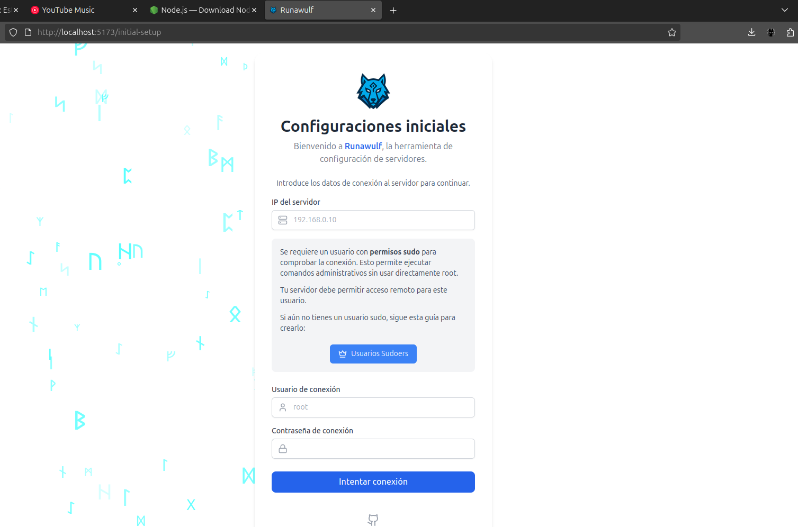
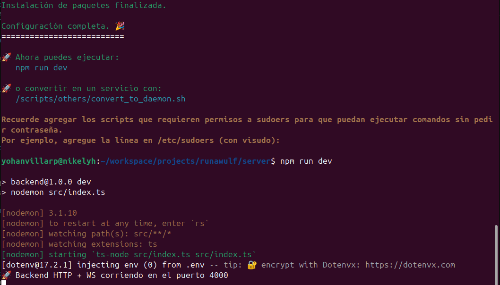
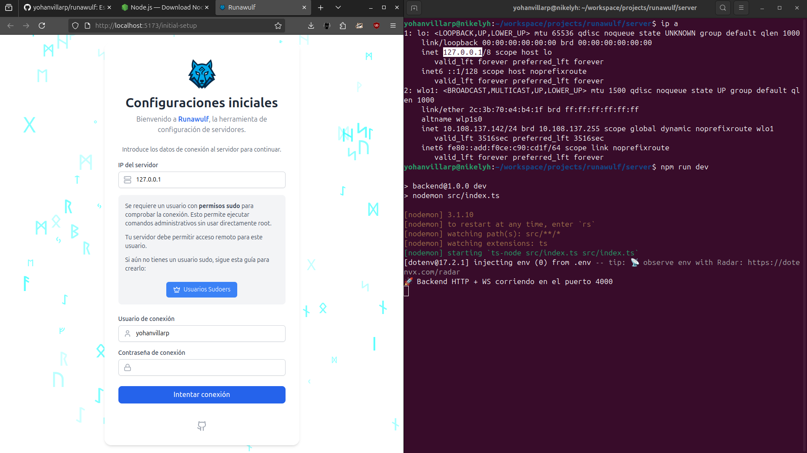
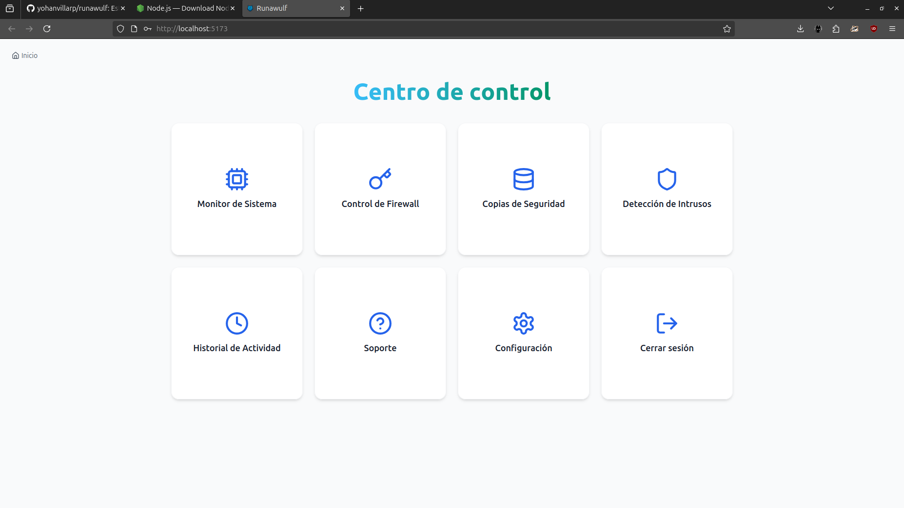

-----

# Runawulf: Ubuntu Server Security & Management GUI

  

**Runawulf** es una interfaz web basada en WebSockets y HTTPS para la administración en tiempo real de servidores Ubuntu. Permite la gestión gráfica de reglas de firewall (`iptables`), monitoreo de recursos y detección de intrusos (`suricata`) sin depender de la terminal.

## 🛠️ Tech Stack

  * **Backend:** Node.js, Express, TypeScript.
  * **Comunicación:** `ws` (WebSockets nativos) para flujo de datos bidireccional en tiempo real y https para ciertos servicios.
  * **Sistema:** Bash scripts, Linux Kernel Utilities.
  * **Seguridad:** Integración con Suricata IDS.

## 📋 Prerrequisitos

Este proyecto requiere acceso privilegiado al sistema para gestionar redes.

  * **SO:** Ubuntu 20.04 LTS o superior.
  * **Dependencias del Sistema:** `suricata` (IDS) e `iptables` (Firewall).
  * **Node.js:** v18.x o superior.

> ⚠️ **Nota:** Si no tienes Node.js, descarga la última versión desde su [sitio oficial](https://nodejs.org/en/download). **No utilices** los repositorios predeterminados de Ubuntu (`sudo apt install npm`) ya que instalan versiones obsoletas.

## 🚀 Instalación y Despliegue

### 1\. Reconocimiento del entorno

Este repositorio es un **monorepo** (contiene tanto el cliente como el servidor). Ten en cuenta la diferencia: puedes clonar el repositorio y ejecutar todo en la misma máquina, o acceder a la interfaz web (cliente) desde otro equipo en la misma red.

### 2\. Clonar el repositorio

```bash
git clone git@github.com:yohanvillarp/runawulf.git
cd runawulf
```

### 3.1. Instalación de dependencias

Instalamos las dependencias de la interfaz visual y el servidor.

```bash
npm install
```

### 3.2 Ejecución del proyecto (Cliente)

Iniciamos la interfaz.

```bash
cd client
npm run dev
```

La interfaz debería iniciar correctamente:


### 4.1 Gestión de permisos (Servidor)

Configuramos los scripts necesarios en el backend.

```bash
cd server
chmod +x setup.sh
./setup.sh
```

### 4.2 Ejecución del proyecto (Servidor)

Debido a que la conversión a servicio de sistema aún es experimental, ejecuta el servidor manualmente:

```bash
npm run dev
```

Deberías ver la confirmación de ejecución:


### 5\. Ingreso a la interfaz

Para conectar la interfaz con el servidor, necesitas la dirección IP. Si estás en la misma máquina usa `127.0.0.1` (localhost), caso contrario, consulta tu IP con:

```bash
ip a
```


Ingresa esa IP en la pantalla de bienvenida:


### 6. Experimenta
Todo listo, prueba los modulos (aún no todos están terminados)
